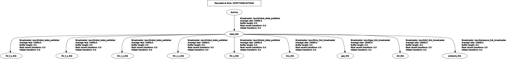

# auv3_localization
This repo contains the configuration for robot_localization pkg in ROS
## Sensor tf

## Odometry Fusion
In our AUV3 there are four sensors (as of now):
| Sensor | Output | ROS Data Type | Scope |
|-|-|-|-|
|IMU|Orientatoin: roll, pitch, yaw - Velocity: Vx, Vy, Vz - Acceleration: ax, ay, az|sensor_msgs/Imu|local|
|DVL||||
|GPS||||
|Pressure Sensor||||
