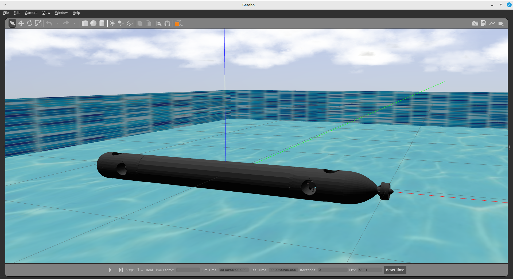
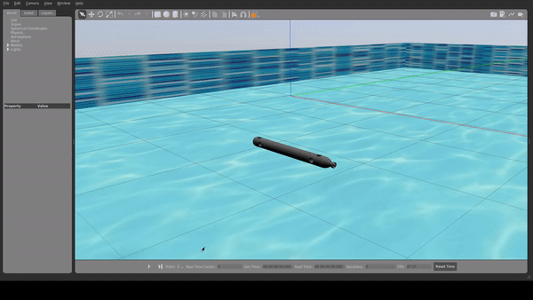

# AUV3 Simulation
<!--  -->


## Setup and Run
```bash
mkdir -p ~/catkin_ws/src
cd ~/catkin_ws
catkin_make
source devel/setup.bash

cd ~/catkin_ws/src
git clone https://github.com/freefloating-gazebo/freefloating_gazebo.git
git clone https://github.com/AUV3/auv3_simulation.git
cd ~/catkin_ws
catkin_make
source devel/setup.bash

cd ~/catkin_ws
roslaunch auv3_simulation auv3_pool_gazebo.launch
```